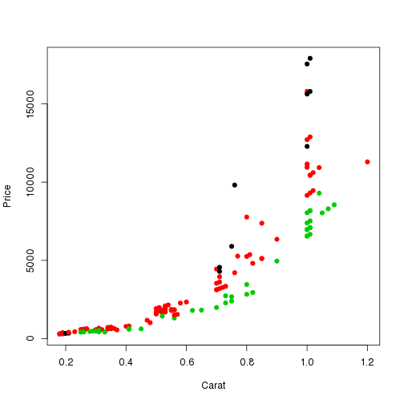
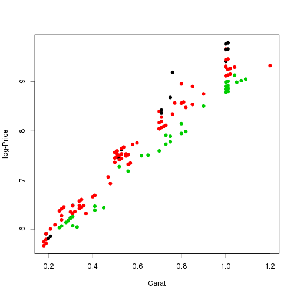

Introduction
============

Objective 1
-----------

In this document, I will investigate diamond prices based on color and carat.

Objective 2
-----------

I also hope to demonstrate different pandoc output types.

Analysis
========

Average price
-------------

The overall average price is 4134.61

Investigating a linear relationship
-----------------------------------

Is there linear relationship between price and carat after accounting for
color?

Log transform of price
----------------------

Final model
-----------

| Variable     | coef estimate   |
| ----------   | --------------- |
| (Intercept)  | 4.96            |
| Carat        | 4.79            |
| ColorF       | 0.19            |
| ColorI       | 0.01            |
| Carat:ColorF | -0.60           |
| Carat:ColorI | -0.92           |
