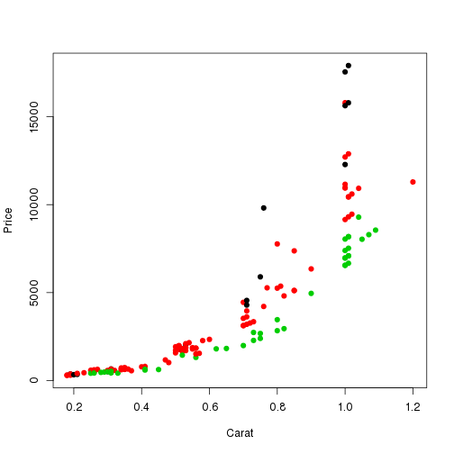

Introduction
============

Objective 1
-----------

In this document, I will investigate diamond prices based on color and carat.

Objective 2
-----------

I also hope to demonstrate different pandoc output types.

Analysis
========

Average price
-------------

The overall average price is 4134.61

Investigating a linear relationship
-----------------------------------

Is there linear relationship between price and carat after accounting for
color?


```r
diamond <- read.csv("./data/diamond.csv")
plot(diamond$Price ~ diamond$Carat, col = diamond$Color, pch = 19,
     ylab = "Price", xlab = "Carat")
```

 

Log transform of price
----------------------


```r
plot(log(diamond$Price) ~ diamond$Carat, col = diamond$Color, pch = 19,
     ylab = "log-Price", xlab = "Carat")
```

 

Final model
-----------


```r
lm1 <- lm(log(Price) ~ Carat * Color, data = diamond)
kable(data.frame(Value = coef(lm1)))
```


|             | Value|
|:------------|-----:|
|(Intercept)  |  4.96|
|Carat        |  4.79|
|ColorF       |  0.23|
|ColorI       |  0.01|
|Carat:ColorF | -0.68|
|Carat:ColorI | -0.92|

There is significant  evidence that the effect for color F on price is is non-zero
after accounting for carat.
